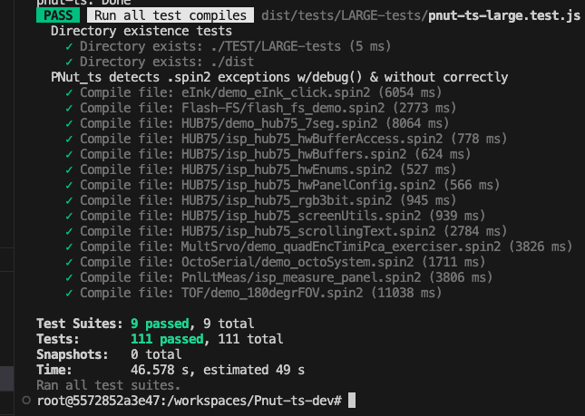

# Pnut-TS Repository Build and test Notes
A re-implementation of PNut for Windows in a platform agnostic language.

![Project Maintenance][maintenance-shield]

[![License][license-shield]](LICENSE)

[![Release][Release-shield]](https://github.com/ironsheep/Pnut-ts-dev/releases)

[![GitHub issues][Issues-shield]](https://github.com/ironsheep/Pnut-ts-dev/issues)


Creating and using your own copy of this repository.

## Table of Contents

On this Page:

- [Starting with this Repository](#starting-with-this-repository) - creating your own local copy of this repo so you can build and test the compiler and any changes you make.<br>(See also [Contributing...]() below.)
- [Container Modes](#container-modes) - understanding the two modes this contain can be in: Coverage and Otherwise (Regression)
- [Reference: Container Built-in Commands](#reference-container-built-in-commands) - the build and test commands used in this container.
- [Reminder: getting latest from repository](#reminder-getting-latest-from-repository) - steps to updating your local copy from the main repostory.
- [Contributing changes to PNut-TS](#contributing-changes-to-pnut-ts) - how to contribute changes you've made back to the PNut-TS project.

Additional pages:

- [Repository README](README.md) - top level page
- [Pnut-TS Command-line](CommandLine.md) - command line reference
- [Pnut-TS Preprocessor](Preprocessor.md) - conditional compilation support
- [PNut-TS coverage notes](Coverage.md) - latest coverage status, how to run coverage, etc.
- [P2\_PNut_Public](https://github.com/parallaxinc/P2_PNut_Public) - Pnut (for Windows) source is currently found in the Parallax Repo

## Starting with this Repository


This repository uses a docker container as the work environment. Make sure you have docker desktop installed and running.

### Step 1

Make work local copy of the PNut-TS repository. Here are the overall steps:

- Clone this [repository](https://github.com/ironsheep/PNut-TS).  
- Open root directory in VSCode. 
- When prompted by VSCode, press [Reopen in container] and [Install] extensions.
- Lastly, run build and regression suite to make sure everying is running.

...and here are the actual commands I use (as an example):

```bash
$ mkdir {workingFolder} # folder in which to place new cloneFolder
$ cd {workingFolder}
$ git clone git@github.com:ironsheep/PNut-TS.git.
$ cd {workingFolder}/{cloneFolder}
$ code .  # to open cloneFolder
# then in VSCode press [**Reopen in Container**]
# npm install will start # loads all needed npm packages
```

After starting VScode then you will be prompted first for [**Reopen in Container**] - **Yes, you need to do this**.  

Once you reopen in the new container, If it's the first time (the container was just created,) then `npm install` will run automatically which installes the supporting npm modules.

Next you will be prompted to install suggested extensions in the new container with a dialog presenting an [**Install**] button. - **Yes, you also want to do this**.

### Step 2
Occasionally, npm itself will be updated. If this happens before you install this repository the terminal output from the `npm install` command will end with a line suggesting that a new version of `npm` is available. When this happens just update npm itself with the following command:

```bash
$ npm install -g npm@10.8.2 # (this is an example, use version shown in terminal output, instead.)
```

### Step 3
Do a test lint & build on the project. 

```bash
$ npm run build

> p2-pnut-ts@0.43.0 prebuild
> mkdir -p dist/ext && ./scripts/prepExt


> p2-pnut-ts@0.43.0 build
> tsc


> p2-pnut-ts@0.43.0 postbuild
> chmod +x dist/pnut-ts.js

```

You can see available scripts in the package.json by entering: <BR>(**NOTE**: *names starting with pre\* or post\* are NOT menat to be run by themselves. The run automatically with the actual \* part of the command is run!*):

```bash
$ npm run
Lifecycle scripts included in p2-pnut-ts@0.43.0:
  pretest
    npm run build && npm run lint
  test
    npm run build && jest -c smm.jestconfig.js

available via `npm run-script`:
  prepack
    npm run esbuild-base -- --minify
  esbuild-base
    npm run copy-ext && esbuild ./src/pnut-ts.ts  --bundle --outdir=./out --entry-names=[dir]/../out/[name] --format=cjs --platform=node && node scripts/insertBuildDate.js
  esbuild
    npm run esbuild-base -- --sourcemap
  esbuild-watch
    npm run esbuild-base -- --sourcemap --watch
  prebuild
    mkdir -p dist/ext && ./scripts/prepExt
  precoverage
    npm run jest-clear && npm run build
  copy-ext
    mkdir -p out/ext && ./scripts/prepExt out/ext
  build
    tsc
  postbuild
    chmod +x dist/pnut-ts.js
  help
    npm run build && dist/pnut-ts.js --help
  test-full
    npm run build && jest -c jest-config/jest-full-config.json
  test-datpasm
    npm run build && jest -c jest-config/jest-datpasm-only-config.json
  test-dbg
    npm run build && jest -c jest-config/jest-dbg-only-config.json
  test-ext
    npm run build && jest -c jest-config/jest-ext-only-config.json
  test-con
    npm run build && jest -c jest-config/jest-con-only-config.json
  test-cov
    npm run build && jest -c jest-config/jest-cov-only-config.json
  test-lrg
    npm run build && jest --verbose -c jest-config/jest-large-only-config.json
  test-pre
    npm run build && jest --verbose -c jest-config/jest-preproc-only-config.json
  test-exc
    npm run build && jest -c jest-config/jest-except-only-config.json
  test-obj
    npm run build && jest -c jest-config/jest-obj-only-config.json
  test-var
    npm run build && jest -c jest-config/jest-var-only-config.json
  test-loader
    npm run build && jest -c jest-config/jest-loader-only-config.json
  test-spin
    npm run build && jest -c jest-config/jest-spin-only-config.json
  test-full-only
    npm run build && jest -c jest-config/jest-full-only-config.json
  test-short-only
    npm run build && jest -c jest-config/jest-short-only-config.json
  cov-setup
    ./scripts/toCov
  cov-chk
    ./scripts/modeCov
  coverage
    npx jest --coverage --verbose
  cov-teardown
    ./scripts/fmCov
  jest-clear
    rm -rf jest-coverage && jest --clearCache
  jest-only
    jest
  watch
    tsc -b -w
  lint
    eslint ./src --ext .ts,.tsx
  prettier-format
    prettier --config .prettierrc.json 'src/**/*.ts' --write
  bld-dist
    npm run build && npm run esbuild && npm pack && pkg .
```

Commands in this list are described in more detail below. See the "**Container Built-in Commands**" reference.

### Step 4
lastly make sure you have a working repo copy. Run the entire regression test suite:

```bash
$ npm test
```

The regression test output should end with somthing like this:


<br>**FIGURE 1**: example Regression Test output.

NOTE: the last test `Compile file: TOF/demo_180degrFOV.spin2 (11056 ms)` actually takes a long time to compile. The test suite has a built-in max time for a test to run. On slower machines this test will fail with exceeded timeout of 20000 ms. If this happens you are just on a slower machine, you should not have to worry about this failure.  *The time on 11056 ms cited above is on my 26-core Mac Studio. Most of us do not have this kind of machine!*

## Container Modes

The container is configured by scripts to be in one of two modes.

1. **Regression Mode**: normal everday state, ready for work, regression testing, and committing changes
2. **Coverage Mode**: special state only used for running the coverage tests. <BR>**WARNING do not commit changes to repository while in this Coverage Mode!**

To determine which mode the container is in you can always run:

```bash
# npm run cov-chk
```

For more about container modes and running coverage, see: [Running Coverage](Coverage.md#running-coverage)


## Reference: Container Built-in Commands

We have a number of built-in commands we use to build code, lint our code, format our code, run tests, etc.

 These commands are run with `npm {command}`.

Lifecycle Scripts:

| Command | Description
| --- | --- |
| start | compile and run pnut-ts.js
| build | lighter-weight build
| test | run the regression tests to ensure all the files still build and the results are correct as compared against the golden files


 These commands are run with `npm run {command}`.

| Command | Description
| --- | --- |
| build | compile all the typescript source in project
| watch | watch for typescript files and recompile when any change
| prettier-format | reformat all the typescript source in project<br>We will keep this list up-to-date as more commands are added.
| build-dist | build the distribution packages
| lint | run lint against all the typescript source in project

### Internal Commands

These are used by other commands:

| Internal Commands | Description
| --- | --- |
| pretest | runs compile and lint before the tests start
| prepack | runs the builder to minify the distribution before the package run happens
| prebuild | makes folder for external parts and places them there before the build starts
| precoverage | clears the jest coverage cache before coverage is run

### Coverage Testing

The coverage environment must be setup for running the coverage tests. 

| Coverage Commands | Description
| --- | --- |
| npm run cov-setup | prepare scripts and folders in order to run coverage
| npm run coveage | run the coverage tests and generate HTML reports
| npm run cov-teardown | restore scripts and folder to their non-coverage state
| npm run cov-chk | determine if the container is in coverage mode (**Coverage Mode**) or not (**Regression Mode**)


## Reminder: getting latest from repository

Assuming you don't havve any uncommitted changes in your workspace then the following steps will make sure you have the latest and greatest contents.

1. Ensure you have VSCode shut down (all instances)
2. From the top of the local repository run `git pull`
3. From the same top run `code .`
4. Once VSCode opens, wait for the [**Reopen in Container**] button to appear. Press it when it does. Wait for the environment to settle down again...
5. In the VSCode terminal window, run `npm test` to ensure the latest code is building and all the tests are running
6. You are ready to resume work with the newest repo content

## Contributing changes to PNut-TS

There are conventional procedures to follow when preparing then contributing changes to an open source project:

Please refer to GitHub Document: [Contributing to a project](https://docs.github.com/en/get-started/exploring-projects-on-github/contributing-to-a-project) - an easy to follow process for creating your own local copy of this code, making changes, then filing a "pull-request" (PR) informing the authors the you have a working change-set to be merged into the compiler.

We're excited to see what changes you would like to contribute!

\- Chip & Stephen

---

> If you like my work and/or this has helped you in some way then feel free to help me out for a couple of :coffee:'s or :pizza: slices or support my work by contributing at Patreon!
>
> [](https://www.buymeacoffee.com/ironsheep) &nbsp;&nbsp; -OR- &nbsp;&nbsp; [](https://www.patreon.com/IronSheep?fan_landing=true)[Patreon.com/IronSheep](https://www.patreon.com/IronSheep?fan_landing=true)

---

## License

Licensed under the MIT License.

Follow these links for more information:

### [Copyright](copyright) | [License](LICENSE)

[maintenance-shield]: https://img.shields.io/badge/maintainer-stephen%40ironsheep%2ebiz-blue.svg?style=for-the-badge

[license-shield]: https://img.shields.io/badge/License-MIT-yellow.svg

[Release-shield]: https://img.shields.io/github/release/ironsheep/Pnut-ts-dev/all.svg

[Issues-shield]: https://img.shields.io/github/issues/ironsheep/Pnut-ts-dev.svg
