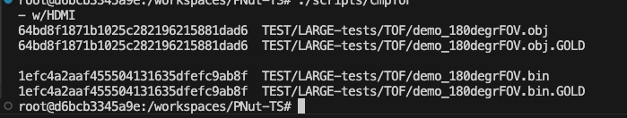
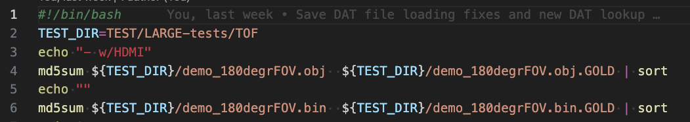
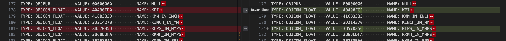
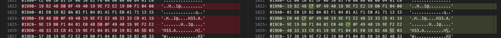
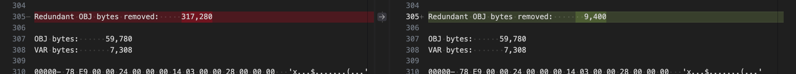
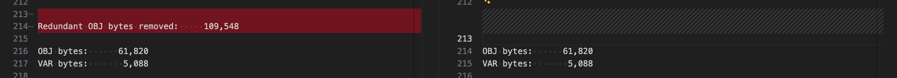

# PNut Reimplementation in TypeScript (PNut-TS) Testing V1.43.0

![Project Maintenance][maintenance-shield]

[![License][license-shield]](LICENSE)

![NodeJS][node-badge]

[![Release][Release-shield]](https://github.com/ironsheep/PNut-TS-dev/releases)

[![GitHub issues][Issues-shield]](https://github.com/ironsheep/PNut-TS-dev/issues)

## Testing v1.43.0

*Thank you for considering helping us do further testing of our new PNut-TS compiler!*

Here's an overview of the process to use for testing. More detailed descriptions, follow.

Testing consists of locating projects that can be compiled with PNut v43 on Windows, compiling the code on Windows and then compiling the same code using our new PNut-TS v1.43.0 compiler.

With each compiler you generate .obj, .bin and .lst files. The files you generated from PNut v43 you rename as .obj.GOLD, .bin.GOLD and .lst.GOLD.  The .GOLD suffix connotes that these are the expected golden output that our new PNut-TS compiler much also generate to be working correctly.

You then compare each of the file types to their .GOLD counterpart expecting them to match.

By way of example, here is what I do:

With the listing (.lst) files I use a simple diff tool. There are a couple regions that can be different and is an **expected difference**.

With the binary files (.obj, .bin) I first calculate a sum for each file and if the sums are different then i do a visual hex difference to inspect the differences. The "floating point constant" **expected difference**, in addition to appearing in the listing files can also appear in the binary files.

This is all discussed in more detail in "**Verifying that files are the same**" below. But first, lets be more specific about how we test.

## Testing Steps

Here's a recap of the testing steps:

1. Locate project source to be tested
2. Compile the project source on Windows with PNut_v43 to generate the needed output files. `pnut_shell {filename}.spin2 -c` (or -cd as needed)
3. Load the source into PNut_v43 to generate the .lst file - if used `-c` then use `File->List Toggle` to generate the .lst file  -OR- - if used `-cd` then use `File->List Toggle with Debug` to generate the .lst file
4. Rename these output files to the .GOLD counterparts: (.lst to .lst.GOLD, etc.)
5. Now compile the same source using PNut-TS non-debug: `pnut-ts -l -O {filename}.spin2` -OR- with-debug: `pnut-ts -l -O -d {filename}.spin2`
6. Compare each of the file pairs (.lst <-> .lst.GOLD, .obj <-> .obj.GOLD, and .bin <-> .bin.GOLD)
7. If any files are different then determine if difference is expected or a code-generation issue
8. If you think you've found a code-generation issue then email us. See "[Send us your project]()" below

Let's next look at how er verify the output files.

## Verifying that files are the same

### Binary files: .bin vs. .bin.GOLD, and .obj vs. .obj.GOLD

The first thing to determine for binary files is are they the same.  I do this with the **md5sum** tool on Linux, or with the **cksum** tool on macOS, or **sha256sum** tool on Windows.  I generate the sums for the files on the platform that I'm running and visually compare the sums.  If they are different the issue will be either constants are 1 bit off, or there is a code-generation problem. It's these code-generation problem cases that we want to hear about (and subsequently fix.)

Here is one of my scripts running the sum generation (in this case I'm on linux using **md5sum**):

 **FIGURE 1:** Authors' comparison script output of .obj and .bin files

As an example, Here is the script I used to generate the above output:

 **FIGURE 2:** Authors' script which generated the above output

**When the files are different** then you'll want a binary/hex diff tool. In VSCode I use the [hexdiff by sh0000e](https://marketplace.visualstudio.com/items?itemName=sj0000e.hexdiff) extension. The instructions tell you how to use it.  The output in **Figure 4**, below, is very similar to how the differences will appear in the hexdiff output from within VSCode.

### Text Files: .lst vs. .lst.GOLD

We expect the .lst and .lst.GOLD files to compare exactly except for a couple minor differences. If you don't see any differences or the differences are only the expected allowed differences then the PNut-TS compiler is working well with your code.  If, however there are any other differences then we want to test with your code so that we can isolate and fix the code-generation problems you have found.

**Allowed Differences**: (1 of 2) Floating point constants

Our floating point constants can be off +/- 1 bit in the Mantissa (bits 22:0). This can cause values to be different in the symbol table and/or in the binary portion of the listing file.  This shows the difference when appearing in the .lst symbol table output:

 **FIGURE 3:** symbol value difference in Symbol Table

While this show the difference when appearing in the binary output portion of the listing;

 **FIGURE 4:** symbol value difference in binary portion of listing

**Allowed Differences**: (2 of 2) Count of Redundant Object Bytes Removed

PNut v43 and PNut-TS v1.43.0 count these bytes differently. So just ignore any difference in this value.  The following Figure 5 and Figure 6 show hhow these differences can appear in the listing file:

 **FIGURE 5:** Redundant Obj Bytes Removed different, OK!

 **FIGURE 6:** Redundant Obj Bytes Removed just not present, OK!

## Send us your project

You've compiled your project and have found differences that appear to be more than any of the expected differences.  In this case, we would like you to send us your project (.zip of all files needed to compile your project) and a narrative describing what you found to be different.  Screen captures are good here too.  (Send to **stephen "at" ironsheep.biz**)  We will then perform the same steps you did and inspect everything ourselves. If you did indeed find a compiler issue, then we will make a smaller version of your code which causes the same failure, enter this new code into our regression test suite, find and fix the problem, then record a new issue in our repostory annotating the problem we found and how it was fixed along with indicating which version of the compiler will have the corresponding fix so that your code conpiles without error.

We will then reply to your email indicating that we've fixed the issue and that a new version is forth coming.  If, in the unlikely case, that we don't think it was a code-generation issue then we will reply explaining our findings/reasoning to you.

## Thank You!

This new PNut_TS compiler will get better with every finding you report. Thank your for your time in helping us make this compiler as good as we can. 

\- *Chip and Stephen*

---

> If you like my work and/or this has helped you in some way then feel free to help me out for a couple of :coffee:'s or :pizza: slices or support my work by contributing at Patreon!
>
>  &nbsp;&nbsp; -OR- &nbsp;&nbsp; [Patreon.com/IronSheep](https://www.patreon.com/IronSheep?fan_landing=true)

---

## License

Licensed under the MIT License.

Follow these links for more information:

### [Copyright](copyright) | [License](LICENSE)

[maintenance-shield]: https://img.shields.io/badge/maintainer-stephen%40ironsheep%2ebiz-blue.svg?style=for-the-badge

[license-shield]: https://img.shields.io/badge/License-MIT-yellow.svg

[Release-shield]: https://img.shields.io/github/release/ironsheep/PNut-TS-dev/all.svg

[Issues-shield]: https://img.shields.io/github/issues/ironsheep/PNut-TS-dev.svg

[node-badge]: https://img.shields.io/badge/node.js-6DA55F?style=for-the-badge&logo=node.js&logoColor=white
